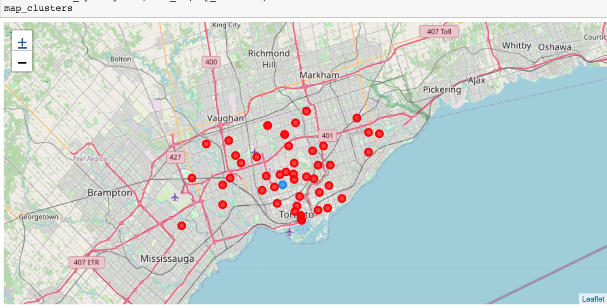
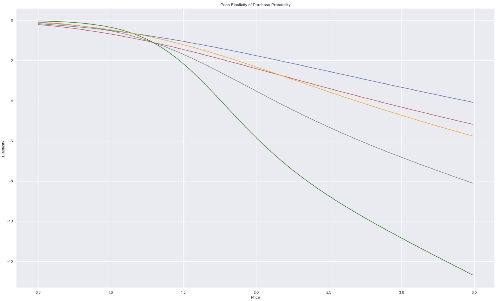
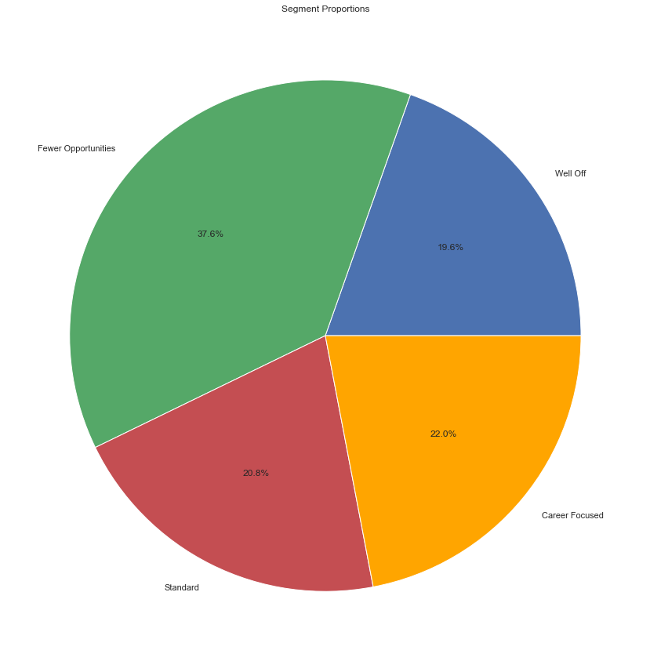
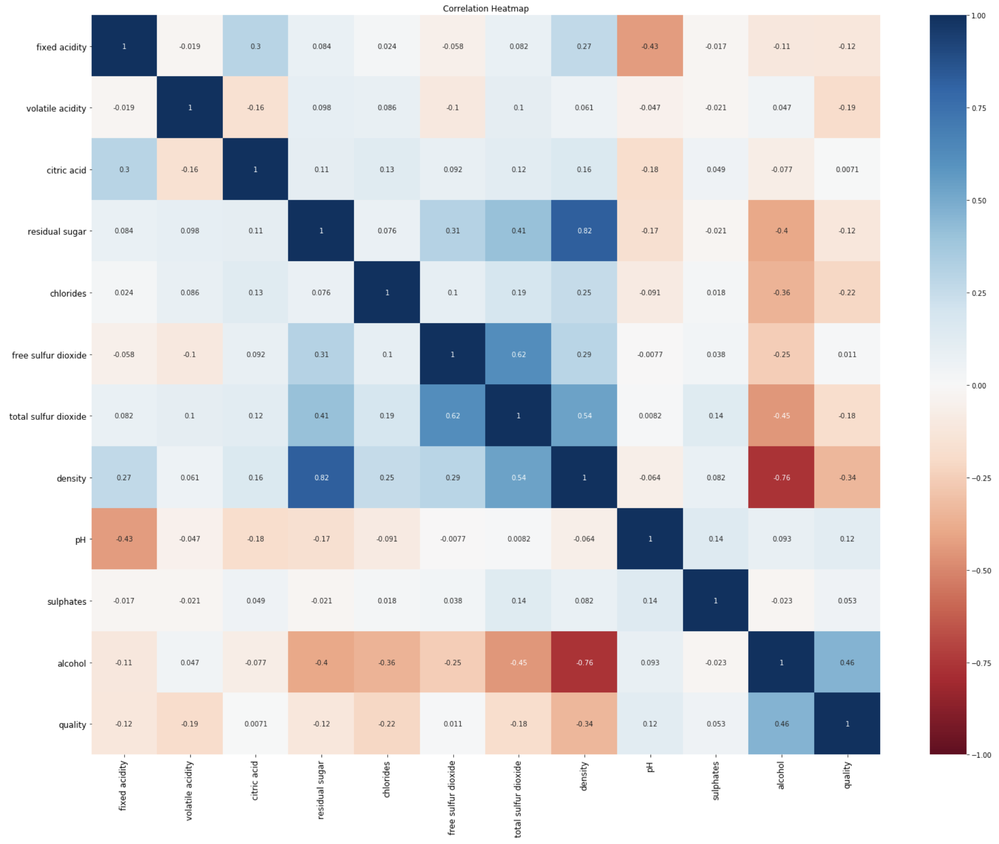

# My-Projects
#### All of my projects and interests related to Data Science and Machine learning

----------------------

Next Project --> 
# - Skin Cancer Detection on ISIC image dataset
### ### TensorFlow2, Keras, Python

-------------------

# - Face recognition
### OpenCV, Deeplearning

-------------------

# - IBM Data Scientist Professional Certification Project
## Best Neighbourhood to open a new Persian restaurant
### Unsupervised learning, K-mean Clustering, Folium Library and Leaflet Map , Predictive Modelling

-------------------
# - Purchase predictions by elasticity through DEEP LEARNING
### AWS, TensorFlow, Keras, Neural Networking
The project will be uploded on 27 Mar 2020

##### link to rep: https://github.com/Arash-Khosravi/Purchase-Prediction-SAAS
--------------------------

# - Customer Segmentation
### Hierarchical Clustering, K-Mean, PCA method, Silhouette method

##### link to rep: https://github.com/Arash-Khosravi/Customer-Clustering
-------------------------

# - This project was to make an insight for WINE dataset in kaggle
### PipeLine, VIF, Logistic Regression

##### link to rep: https://github.com/Arash-Khosravi/Wine-Attributes
--------------------------

# - Analyzing data from previous US presidential elections
- Analysing and data cleaning 
- Making the prediction of next election

----------------------------

# - EDA and Data Cleaning
- Statistical analysis and data visualization
- Statistical modeling, model selection and result interpretation
- Looking into trip data form BIXI, Montréal's bicycle sharing system

----------------------------

# - SQL Queries on MySQL Workbench and data Visualization 

 - Data visualization and reporting using Tableau and Microsoft Excel
 
 

-------------------------------------------------------

### Note: The last three projects were delivered as project assignments for BrainStation's Data Science Diploma program and cannot be shared publicly.

