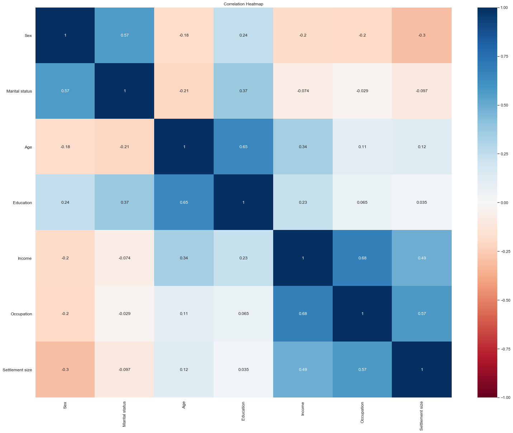
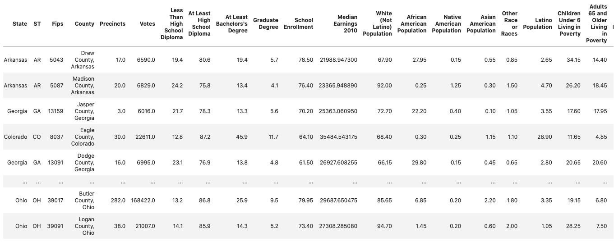
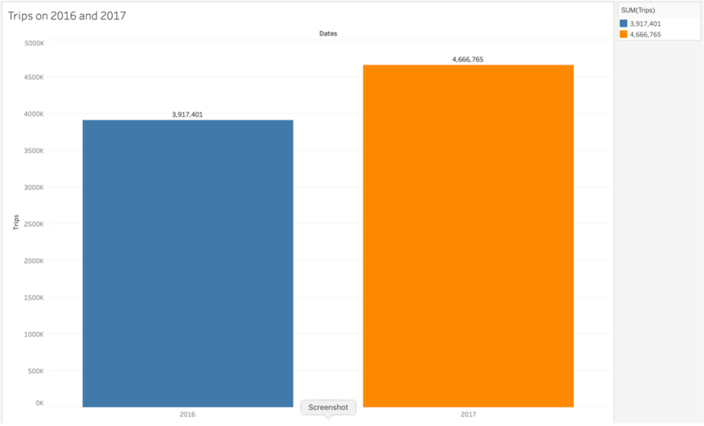
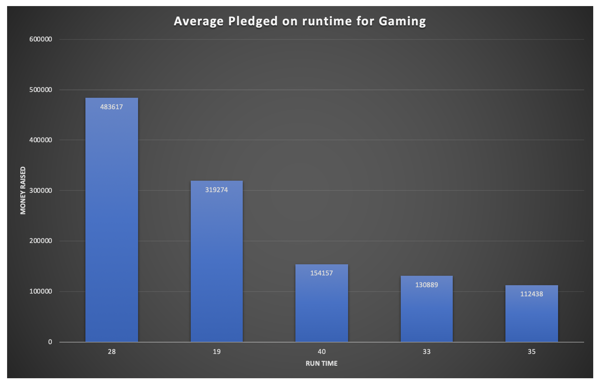

# My-Projects
All my projects and interests related to Data Science and Machine learning

Next Project --> 
# Purchase predictions through DEEP LEARNING
The project will be uploded on 23 Mar 2020

--------------------------
Current project:
# Customer Segmentation for a physical store
The project will be uploded on 17 Mar 2020

--------------------------
# Analyzing data from previous US presidential elections
- Analysing and data cleaning 
- Making the prediction of next election

----------------------------

# EDA and Data Cleaning
- Statistical analysis and data visualization
- Statistical modeling, model selection and result interpretation
- Looking into trip data form BIXI, Montréal's bicycle sharing system

----------------------------
# SQL Queries on MySQL Workbench and data Visualization 

 - Data visualization and reporting using Tableau and Microsoft Excel
 
 
 
 ---------------------------------------------------------------------
# Note: The last three projects were delivered as project assignments for BrainStation's Data Science Diploma program and cannot be shared publicly. 
